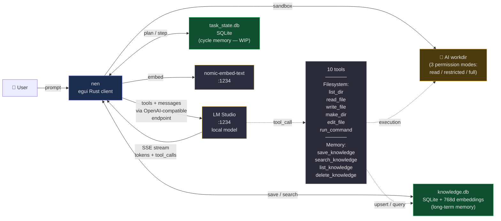

# 灯 nen

**Desktop chat client in Rust for LM Studio, with tool calling and persistent vector memory.**

> *nen (念)* — an ancient Buddhist kanji meaning the immediate thought, the focused attention on the present moment. It is the mental working buffer — applicative short-term memory. The project bears this name because it **assists the immediate thought of a local LLM** without overriding it.

---

## Thesis

**A small, well-harnessed local model gets the job done. No need for a large cloud model.**

A 9B LLM (Qwen3.5, GLM-flash, Gemma, etc.) runs on a consumer GPU (e.g. RTX 3060 12 GB). Properly equipped with tools (sandbox, filesystem, shell, vector memory), guided by a minimal system prompt (targeted, not verbose), and following a context-offload pattern (extract → save → forget), it accomplishes 80–95 % of everyday assistance tasks.

This project demonstrates that **intelligent frugality** beats **raw power** for individual use. Zero cloud calls, zero telemetry, zero subscription. Everything lives on the user's machine.

---

## Functional architecture



---

## What works already (v10)

### 6 system tools (sandboxed workdir, 3 permission levels)

| Tool | Purpose | Cap |
|---|---|---|
| `list_dir(path)` | List a directory (skipping internal artifacts) | 200 entries |
| `read_file(path, start_line?, end_line?)` | Read a text file | 1 MB max |
| `write_file(path, content)` | Write a file, creates parents if needed | — |
| `make_dir(path)` | Recursively create a directory | — |
| `edit_file(path, old, new)` | Replace a unique string | — |
| `run_command(command)` | Execute a shell command | 30s timeout + taskkill |

### 4 vector memory tools

| Tool | Purpose |
|---|---|
| `save_knowledge(title, content, tags?)` | Embed (nomic-embed-text) → store in knowledge.db |
| `search_knowledge(query, limit?)` | Semantic search (pure Rust cosine similarity) |
| `list_knowledge(tag?)` | List entries, optional tag filter |
| `delete_knowledge(id)` | Delete an entry by id |

### Infrastructure

- **SSE streaming** token-by-token with robust parsing of fragmented `delta.tool_calls`
- **Path jail sandbox** via `check_access()` — canonicalize + verify workdir membership
- **3 permission modes**: read-only, restricted (read + write within workdir), full (with run_command)
- **Thought Flow panel** — structured reasoning visible in real time
- **Custom system prompt** loaded from `system_prompt.txt` (not versioned, kept private)
- **Auto-injection of workdir context** when tools are enabled
- **3 unit tests**: workdir filtering, knowledge.db schema (with embedding round-trip), task_state.db schema

---

## Decision branches in progress

### 🔀 Branch 1 — Cycle Agent pattern (WIP)

**Problem**: a small 9B LLM loses coherence as its context grows. Long chains of multiple tool calls eventually slip into textual XML format instead of the proper API call (observed behavior).

**Proposed solution**: split a complex task into atomic sub-steps, purging context between each. The LLM writes into `task_state.db` what it just did, purges, re-reads the state, executes the next step.

**State**: `task_state.db` schema in place (3 tables: tasks, steps, cycle_prompts) + `open_task_db()` functions. **4 tools still to wire**:
- `plan_task(description, steps[])`
- `step_done(step_id, findings)`
- `step_failed(step_id, error)`
- `task_done(task_id, summary)`

### 🔀 Branch 2 — Windows stdout encoding fix

PowerShell commands emitting UTF-8 produce double-mojibake (`Résultat` instead of `Résultat`). To fix by prefixing `[Console]::OutputEncoding = UTF8`.

### 🔀 Branch 3 — Model-agnostic design confirmed

The architecture is independent of the underlying LLM. Any OpenAI-compatible endpoint works without modification (LM Studio, Ollama, vLLM, SGLang). Tested on Qwen3.5-9B; to be benchmarked on GLM-4.7-flash and Gemma-4.

---

## Roadmap

Openly shared — if this project doesn't reach every goal, it may at least inspire others to pick up the pattern.

### 🎯 Priority — Cycle Agent (unlocks long-horizon tasks)
- [ ] `plan_task(description, steps[])` — persist task + initial steps in `task_state.db`
- [ ] `step_done(step_id, findings)` — mark step complete, record findings, fetch next
- [ ] `step_failed(step_id, error)` — mark step failed, record error
- [ ] `task_done(task_id, summary)` — close task with final summary
- [ ] `stream_cycle_agent()` — execution loop with context purge between steps
- [ ] UI toggle "Standard mode / Cycle mode" + dedicated tab to visualize ongoing tasks/steps

### 🧰 Tool refinements
- [ ] `edit_knowledge(id, fields)` — update a memory entry without delete+re-save
- [ ] `read_file` on a directory → clear error `"This is a directory — use list_dir instead"` (currently returns cryptic OS error 5)
- [ ] Symmetry: also block `_thought_flow.*` inside `read_file` (currently only filtered in `list_dir` and workdir context)
- [ ] Optional soft cap on command output length (long stdout can bloat context)

### 🔧 Infrastructure
- [ ] Fix Windows PowerShell stdout encoding (`[Console]::OutputEncoding = UTF8` prefix to eliminate double-mojibake `Résultat`)
- [ ] Reproducible test suite (3–5 multi-tool prompts replayed at every version to detect regressions)
- [ ] Split `main.rs` (currently ~4,700 lines) into focused modules
- [ ] Proper logging with log levels (replace ad-hoc prints)

### 📊 Benchmarks
- [ ] Head-to-head: Qwen3.5-9B vs GLM-4.7-flash vs Gemma-4 vs Phi-4 on the same prompt set
- [ ] Scoring grid: hallucinates / gives up / completes / quality of output
- [ ] Publish results to help others choose a local model

### 💡 Nice-to-have (open ideas)
- [ ] Export a session as a self-contained HTML (archive + shareable)
- [ ] Import/export knowledge.db between machines (sync own memory across devices)
- [ ] Multi-workdir switching without restart
- [ ] Plugin-style tool loading (user-defined tools without rebuilding)
- [ ] Optional local speech-to-text input (Whisper) for voice interaction

---

## Build

```bash
cargo build --release
./target/release/test_egui_chat.exe
```

## Tests

```bash
cargo test --release
```

Three tests included:
- `list_dir_filters_thought_flow_artifacts`
- `knowledge_db_schema_is_valid` (embedding round-trip + cosine)
- `task_db_schema_is_valid`

## Requirements

- [Rust](https://rustup.rs/) stable
- [LM Studio](https://lmstudio.ai/) with:
  - A chat model loaded (tested with `qwen/qwen3.5-9b`, compatible with any tool-calling model)
  - `text-embedding-nomic-embed-text-v1.5` for vector memory

## Configuration

Create a `system_prompt.txt` file at the root to guide the model. Minimal example (respecting the "no verbose noise for small models" principle):

```
You are an assistant using tools on a Windows machine.

Persistent memory:
- Before handling a task that may already have been addressed: search_knowledge first.
- After discovering durable information: save_knowledge(title, content, tags).
- Large file: extract key values, save_knowledge(excerpt), work from the save.

Call tools directly without announcing them.
```

---

## Why this project exists

Mainstream LLM assistants are **cloud-only, opaque, subscription-based, surveilled**. The data entrusted to them leaves the machine. Their behavior can change overnight due to invisible decisions.

`nen` starts from the opposite bet: **everything runs locally**, **nothing leaves**, **every line of code is understandable**. Empirical tests show that a local 9B + a carefully designed harness can perform the vast majority of everyday assistance tasks — writing, coding, documentation lookup, file manipulation, summarization.

This is not a competitor to Claude/GPT/Gemini on edge tasks. It is an **everyday autonomy tool** for those who value:

- 🔒 Absolute privacy (nothing leaves the machine)
- 🛠️ Understandability (legible Rust code, ~4,700 lines, no magic)
- ♾️ Independence (no subscription, no risk of service shutdown)
- 🎯 Frugality (RTX 3060 12 GB is enough, energy-efficient compared to cloud)

**Small, local, understood, mastered. That is the thesis.**

---

## License

TBD
