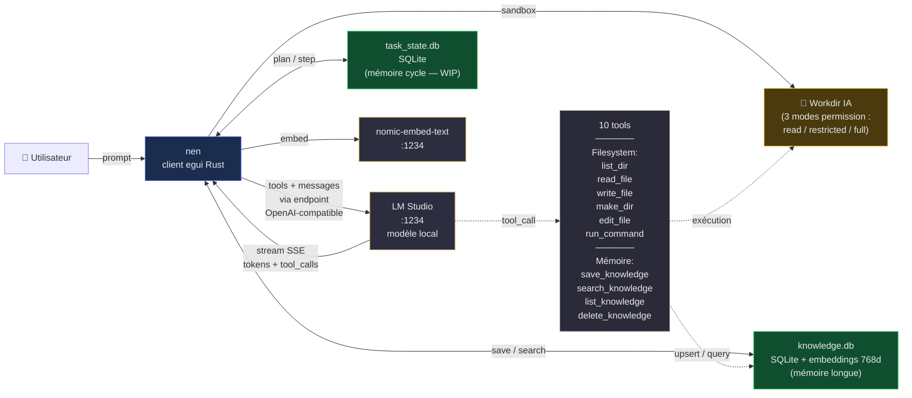

# 灯 nen

**Client chat desktop en Rust pour LM Studio, avec tool calling et mémoire vectorielle persistante.**

> *nen (念)* — kanji ancien bouddhiste signifiant la pensée immédiate, l'attention focalisée sur le moment présent. C'est le buffer de travail mental, la mémoire courte applicative. Le projet porte ce nom parce qu'il **assiste la pensée immédiate d'un LLM local** sans l'écraser.

---

## Thèse

**Un petit modèle local bien harnaché fait le boulot. Il n'y a pas besoin d'un gros modèle cloud.**

Un LLM 9B (Qwen3.5, GLM-flash, Gemma, etc.) tourne sur une RTX 3060 4 Go. Correctement équipé d'outils (sandbox, fichiers, shell, mémoire vectorielle), d'une guidance minimale (system prompt ciblé, pas verbeux), et d'un pattern de décharge de contexte (extraire-sauvegarder-oublier), il accomplit 80 à 95 % des tâches d'assistance quotidiennes.

Le projet démontre que la **frugalité intelligente** bat la **puissance brute** pour l'usage individuel. Zéro appel cloud, zéro télémétrie, zéro abonnement. Tout vit sur la machine de l'utilisateur.

---

## Architecture fonctionnelle



---

## Ce qui marche déjà (v10)

### 6 tools système (sandbox workdir, 3 niveaux de permission)

| Tool | Usage | Cap |
|---|---|---|
| `list_dir(path)` | Liste un dossier (sans artefacts internes) | 200 entrées |
| `read_file(path, start_line?, end_line?)` | Lit un fichier texte | 1 Mo max |
| `write_file(path, content)` | Écrit un fichier, crée les parents si besoin | — |
| `make_dir(path)` | Crée un dossier récursif | — |
| `edit_file(path, old, new)` | Remplace une string unique | — |
| `run_command(command)` | Exécute une commande shell | timeout 30s + taskkill |

### 4 tools mémoire vectorielle

| Tool | Usage |
|---|---|
| `save_knowledge(title, content, tags?)` | Embed nomic-embed-text → stocke dans knowledge.db |
| `search_knowledge(query, limit?)` | Recherche sémantique (cosine similarity pur Rust) |
| `list_knowledge(tag?)` | Liste les entrées, filtrage optionnel par tag |
| `delete_knowledge(id)` | Supprime une entrée par id |

### Infra

- **Streaming SSE** token-by-token avec parsing robuste des `delta.tool_calls` fragmentés
- **Sandbox path jail** via `check_access()` — canonicalize + vérifie appartenance au workdir
- **3 modes permission** : read-only, restricted (read + write dans workdir), full (avec run_command)
- **Thought Flow panel** — raisonnement structuré visible en temps réel
- **System prompt personnalisé** chargé depuis `system_prompt.txt` (non versionné, privé)
- **Injection auto du contexte workdir** quand tools activés
- **3 tests unitaires** : filtrage workdir, schéma knowledge.db (+ round-trip embedding), schéma task_state.db

---

## Branches de décisions en cours

### 🔀 Branche 1 — Cycle Agent pattern (WIP)

**Problème** : un petit LLM 9B perd en cohérence quand son contexte s'allonge. Les chaînes de multiples tool calls finissent par glisser en format XML textuel au lieu de l'API (leçon observée).

**Solution envisagée** : découper une tâche complexe en sous-étapes atomiques, avec purge du contexte entre chaque étape. Le LLM écrit dans `task_state.db` ce qu'il vient de faire, purge, relit l'état, exécute l'étape suivante.

**État** : schéma `task_state.db` posé (3 tables : tasks, steps, cycle_prompts) + fonctions `open_task_db()`. **4 tools à câbler** :
- `plan_task(description, steps[])`
- `step_done(step_id, findings)`
- `step_failed(step_id, error)`
- `task_done(task_id, summary)`

### 🔀 Branche 2 — Fix encoding stdout Windows

Les commandes PowerShell avec UTF-8 produisent du double-mojibake (`Résultat` au lieu de `Résultat`). À fixer par `[Console]::OutputEncoding = UTF8` préfixé.

### 🔀 Branche 3 — Agnosticisme modèle confirmé

L'architecture est indépendante du modèle LLM. Tout modèle compatible endpoint OpenAI (LM Studio, Ollama, vLLM, SGLang) fonctionne sans modification. Testé sur Qwen3.5-9B ; à bencher sur GLM-4.7-flash et Gemma-4.

---

## Build

```bash
cargo build --release
./target/release/test_egui_chat.exe
```

## Tests

```bash
cargo test --release
```

Trois tests inclus :
- `list_dir_filters_thought_flow_artifacts`
- `knowledge_db_schema_is_valid` (round-trip embedding + cosine)
- `task_db_schema_is_valid`

## Prérequis

- [Rust](https://rustup.rs/) stable
- [LM Studio](https://lmstudio.ai/) avec :
  - Un modèle chat chargé (testé `qwen/qwen3.5-9b`, compatible tout modèle supportant le tool calling)
  - `text-embedding-nomic-embed-text-v1.5` pour la mémoire vectorielle

## Configuration

Créer un fichier `system_prompt.txt` à la racine pour guider le modèle. Exemple minimal (respecte le principe "pas de bruit verbeux pour les petits modèles") :

```
Tu es un assistant qui utilise des tools sur un poste Windows.

Mémoire persistante :
- Avant une tâche qui pourrait avoir déjà été traitée : search_knowledge d'abord.
- Après une info durable découverte : save_knowledge(title, content, tags).
- Fichier volumineux : extrais les valeurs clés, save_knowledge(extrait), travaille à partir du save.

Appelle les tools directement sans les annoncer.
```

---

## Fondamental — pourquoi ce projet

Les assistants LLM grand public sont **cloud-only, opaques, abonnés, surveillés**. Les données qu'on leur confie sortent de la machine. Leur comportement peut changer du jour au lendemain selon des décisions invisibles.

`nen` part d'un pari inverse : **tout tourne en local**, **rien ne sort**, **on comprend chaque ligne de code**. Les tests empiriques montrent qu'un 9B local + un harnais soigné peut accomplir la grande majorité des tâches d'assistance quotidiennes — écriture, code, recherche documentaire, manipulation de fichiers, synthèse.

Ce n'est pas un concurrent de Claude/GPT/Gemini sur les tâches limite. C'est un **outil d'autonomie quotidienne** pour qui valorise :

- 🔒 La vie privée absolue (rien ne quitte la machine)
- 🛠️ La compréhensibilité (code Rust lisible, 4 500 lignes, zéro magie)
- ♾️ L'indépendance (aucun abonnement, aucun risque de fermeture de service)
- 🎯 La frugalité (RTX 3060 4 Go suffit, économie d'énergie par rapport au cloud)

**Petit, local, compris, maîtrisé. C'est la thèse.**

---

## Licence

TBD
